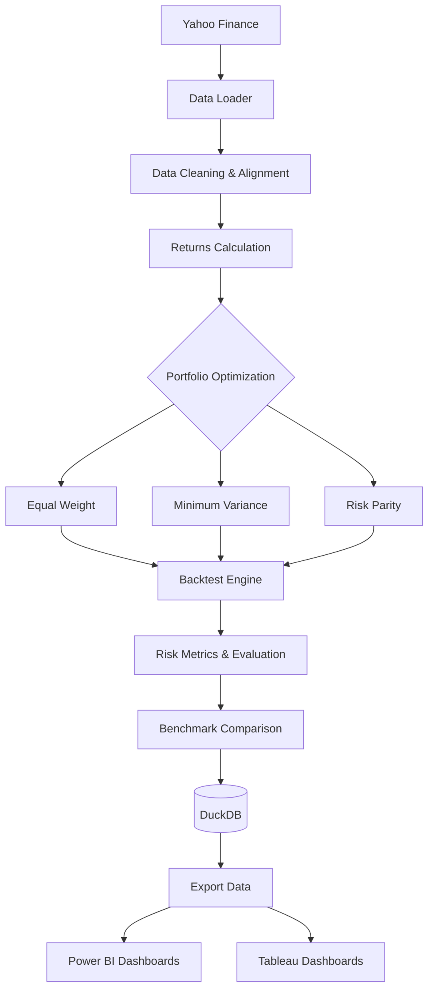

[Python 3.x] [DuckDB] [License: MIT] [Status: Complete]

# Quantitative Portfolio Research & Backtesting Platform
> An end-to-end quantitative framework for portfolio construction, optimization, backtesting, and risk analysis.

> **Student / Interview Guide**: Looking for a complete, zero-finance-knowledge walkthrough of every term, formula, code module, and interview question? Check out the **[Master Student Study & Interview Guide](study_guide/STUDENT_INTERVIEW_GUIDE.md)**!

## Table of Contents
- [Project Overview](#project-overview)
- [Motivation](#motivation)
- [Initial Scope: Why 12 Stocks](#initial-scope-why-12-stocks)
- [Scalability Plan](#scalability-plan)
- [Key Features](#key-features)
- [Architecture](#architecture)
- [Tech Stack](#tech-stack)
- [Stock Universe](#stock-universe)
- [Portfolio Strategies](#portfolio-strategies)
- [Risk Metrics](#risk-metrics)
- [Backtesting Methodology](#backtesting-methodology)
- [Look-Ahead Bias Prevention](#look-ahead-bias-prevention)
- [Transaction Cost Model](#transaction-cost-model)
- [Database Architecture](#database-architecture)
- [Dashboards (Power BI & Tableau)](#dashboards-power-bi--tableau)
- [Project Structure](#project-structure)
- [Installation](#installation)
- [Quick Start](#quick-start)
- [Example Output](#example-output)
- [Limitations](#limitations)
- [Future Improvements](#future-improvements)
- [Contributing](#contributing)
- [License](#license)
- [Disclaimer](#disclaimer)

---

## Project Overview
It is a comprehensive quantitative finance platform designed to construct, optimize, backtest, and evaluate equity portfolios against a standard market benchmark. Built entirely in Python, it integrates robust financial data retrieval, advanced optimization techniques, analytical database storage (DuckDB), and extensive risk metrics calculation over a 5-year historical horizon.

## Motivation
Bridging the gap between mathematical theory and practical algorithmic trading, this platform demonstrates the end-to-end pipeline of a quantitative strategy. The primary motivation is to build a scalable, statistically rigorous environment to evaluate how modern portfolio theory (MPT) strategies perform dynamically in real-market conditions, particularly highlighting risk-adjusted performance metrics.

## Initial Scope: Why 12 Stocks
While institutional models analyze thousands of assets, this project initially limits the universe to 12 highly liquid large-cap stocks. This intentional design choice serves several purposes:
1. **Covariance Matrix Stability:** Working with a massive number of stocks (N > 100) often leads to ill-conditioned covariance matrices, requiring complex shrinkage techniques. 12 stocks ensure computational stability during optimization.
2. **Interpretability:** Tracing portfolio weights, tracking errors, and performance drivers is highly transparent and explainable (critical for academic and interview settings).
3. **Sector Diversification:** The chosen 12 assets provide broad representation across 7 distinct GICS sectors, mimicking a macro-diversified portfolio on a micro-scale.

## Scalability Plan
The platform is designed to scale gracefully as computational resources and data access grow.

| Phase | Asset Count | Required Architectural Changes |
| :--- | :--- | :--- |
| **Phase 1 (Current)** | 12 | Standard sample covariance, direct SciPy optimization (SLSQP). |
| **Phase 2 (Medium)** | 25 - 50 | Introduction of Ledoit-Wolf shrinkage for covariance matrices, robust parallel processing for data ingestion. |
| **Phase 3 (Scale)** | 100+ | Migration to PostgreSQL (from DuckDB), integration of factor models (e.g., Fama-French) for dimensionality reduction in risk modeling, convex optimization solvers (CVXPY) replacing SLSQP. |

## Key Features
- Automated data pipeline using `yfinance`.
- Rigorous prevention of look-ahead bias through strict temporal indexing.
- Monthly rebalancing logic with realistic transaction cost modeling.
- Three distinct portfolio optimization strategies: Equal Weight, Minimum Variance, and Risk Parity.
- Comprehensive calculation of advanced risk-adjusted return metrics.
- Seamless integration with DuckDB for high-speed analytical queries.

## Architecture



## Tech Stack

| Category | Technology | Purpose |
| :--- | :--- | :--- |
| **Language** | Python 3.x | Core programming, data manipulation, optimization. |
| **Data Manipulation** | Pandas, NumPy | Time-series alignment, vectorized operations. |
| **Optimization** | SciPy (SLSQP) | Solving constrained portfolio weight optimization problems. |
| **Market Data** | yfinance | Free tier historical daily OHLCV equity and benchmark data. |
| **Database** | DuckDB | Columnar, in-process analytical SQL database; zero-setup. |
| **Visualization** | Power BI, Tableau | Interactive BI dashboards for performance reporting. |

## Stock Universe

| Ticker | Company | Sector | Exchange |
| :--- | :--- | :--- | :--- |
| AAPL | Apple Inc. | Technology | NASDAQ |
| MSFT | Microsoft Corp. | Technology | NASDAQ |
| GOOGL| Alphabet Inc. | Communication Services | NASDAQ |
| JPM | JPMorgan Chase & Co. | Financials | NYSE |
| JNJ | Johnson & Johnson | Healthcare | NYSE |
| PG | Procter & Gamble | Consumer Defensive | NYSE |
| XOM | Exxon Mobil Corp. | Energy | NYSE |
| CAT | Caterpillar Inc. | Industrials | NYSE |
| AMZN | Amazon.com Inc. | Consumer Cyclical | NASDAQ |
| BRK-B| Berkshire Hathaway | Financials | NYSE |
| LLY | Eli Lilly and Co. | Healthcare | NYSE |
| NEE | NextEra Energy | Utilities | NYSE |
| **^GSPC** | **S&P 500 Index** | **Benchmark** | **Index** |

*Date Range analyzed:* 2019-01-01 to 2024-12-31 (5 Years)

## Portfolio Strategies

### 1. Equal Weight (1/N)
- **Description:** Allocates exactly $1/N$ of total capital to each of the $N$ assets in the portfolio.
- **Formula:** $w_i = \frac{1}{N} \quad \forall i \in \{1, 2, ..., N\}$
- **Pros:** Highly robust, requires no parameter estimation, implicitly forces buy-low/sell-high during rebalancing.
- **Cons:** Ignores asset risk and correlations; heavily skewed by highly volatile assets.

### 2. Minimum Variance
- **Description:** Finds the weight vector that minimizes the overall portfolio variance based on the historical covariance matrix.
- **Formula:** $\min_w w^T \Sigma w$ subject to $\sum w_i = 1$ and $w_i \ge 0$
- **Pros:** Theoretically provides the lowest risk portfolio on the efficient frontier.
- **Cons:** Highly sensitive to estimation errors in the covariance matrix; often results in highly concentrated portfolios.

### 3. Risk Parity (Equal Risk Contribution)
- **Description:** Allocates capital such that the marginal contribution to total portfolio risk is equal for every asset.
- **Formula:** $w_i \times \frac{\partial \sigma_p}{\partial w_i} = \frac{\sigma_p}{N}$
- **Pros:** True risk diversification rather than just capital diversification; generally more robust than mean-variance optimization.
- **Cons:** Complex to optimize non-linearly; relies on historical correlations persisting.

## Risk Metrics

| Metric | Formula / Approach | Description |
| :--- | :--- | :--- |
| **Total Return** | $\prod (1 + R_t) - 1$ | Cumulative return over the entire period. |
| **CAGR** | $(EV/BV)^{(1/years)} - 1$ | Compound Annual Growth Rate. |
| **Volatility** | $\sigma_d \times \sqrt{252}$ | Annualized standard deviation of daily returns. |
| **Sharpe Ratio** | $(R_p - R_f) / \sigma_p$ | Risk-adjusted return over the risk-free rate (5%). |
| **Sortino Ratio** | $(R_p - R_f) / \sigma_{down}$ | Return relative to downside deviation only. |
| **Max Drawdown** | $\min (P_t / \max(P_{t}) - 1)$ | Largest peak-to-trough drop in portfolio value. |
| **Beta ($\beta$)** | $Cov(R_p, R_m) / Var(R_m)$ | Systematic risk relative to the S&P 500 benchmark. |
| **Calmar Ratio** | $CAGR / \|Max Drawdown\|$ | Return relative to the maximum drawdown risk. |
| **Tracking Error** | $\sigma(R_p - R_m) \times \sqrt{252}$ | Volatility of the active returns relative to the benchmark. |

## Backtesting Methodology
- **Estimation Window:** Optimization relies strictly on historical data available *prior* to the rebalance date.
- **Rebalancing Frequency:** Monthly (last trading day of the month).
- **Risk-Free Rate:** Assumed constant at 5% annually for Sharpe/Sortino calculations.
- **Execution:** Assumes execution at the closing price of the rebalance day.

## Look-Ahead Bias Prevention
Look-ahead bias is strictly prevented at the code level by isolating the data available for weight generation from the data used for performance calculation.

```python
# Conceptual Example of Bias Prevention
def calculate_weights_for_month_M(data):
    # Strictly subset data up to the last day of month M-1
    historical_data = data.loc[:last_day_of_previous_month]
    
    # Calculate covariance and optimize based ONLY on history
    cov_matrix = historical_data.cov()
    weights = optimize(cov_matrix)
    
    return weights
```
Weights calculated using data up to month $T-1$ are applied to the returns of month $T$.

## Transaction Cost Model
Transaction costs simulate the friction of real-world trading, accounting for bid-ask spreads, slippage, and broker commissions.
- **Cost Assumption:** 10 basis points (0.10%) per one-way trade.
- **Formula:** $TC_t = 0.0010 \times \sum_{i=1}^N |w_{i, t} - w_{i, t-1}| \times PortfolioValue_t$
Transaction costs are deducted from the portfolio value at every monthly rebalance.

## Database Architecture
The project utilizes **DuckDB** as a high-performance, embedded columnar analytical database (`quant_portfolio.duckdb`).
- **Tables:** `assets`, `price_data`, `strategies`, `portfolio_weights`, `backtest_results`, `risk_metrics`.
- **Why DuckDB?** It offers OLAP columnar speed for complex time-series queries directly in Python without the overhead of setting up a standalone server, while remaining fully PostgreSQL-compliant.
- **Migration Path:** As DuckDB supports standard SQL, migration to PostgreSQL simply involves pointing to a PostgreSQL connection URI and executing `sql/schema.sql`.

## Dashboards (Power BI & Tableau)

### Power BI Dashboard (`dashboards/powerbi/README.md`)
- **Page 1: Portfolio Overview:** KPI cards (CAGR, Max Drawdown, Sharpe), equity curve comparisons against the S&P 500.
- **Page 2: Strategy Comparison:** Risk/Return scatter plots, annualized metric bar charts, strategy rankings.
- **Page 3: Portfolio Risk & Allocation:** Drawdown underwater charts and dynamic stacked area charts showing asset weights over monthly rebalancing dates.

### Tableau Dashboard (`dashboards/tableau/README.md`)
- **5 Complete Worksheets:** Equity curves, risk metrics comparison, portfolio weight heatmaps, drawdown curves, and Risk-Return frontier scatter plots.

## Project Structure
```text
QuantPortfolio-Research-Backtesting/
├── README.md                      # GitHub documentation & project guide
├── LICENSE                        # MIT License
├── requirements.txt               # Dependencies
├── main.py                        # 10-step pipeline orchestration script
├── quant_portfolio.duckdb         # Persisted DuckDB analytical database
├── study_guide/                   # Master student study & interview guide
│   └── STUDENT_INTERVIEW_GUIDE.md # Zero-finance dictionary, math walkthrough, 53 Q&As
├── data/
│   ├── raw/                       # Cached raw market price downloads
│   ├── processed/                 # Validated & cleaned asset & benchmark prices
│   └── exports/                   # Tidy, dashboard-ready CSVs for BI tools
├── src/                           # 11 Core Python Modules
│   ├── config.py                  # Global settings, universe, risk parameters
│   ├── data_loader.py             # yfinance downloader with local disk caching
│   ├── data_cleaning.py           # 5-stage validation & cleaning pipeline
│   ├── returns.py                 # Simple, log, cumulative, & rolling returns
│   ├── portfolio.py               # Allocation mathematics & quadratic form variance
│   ├── optimization.py            # SLSQP Min-Variance & Risk Parity solvers
│   ├── backtest.py                # Look-ahead-bias-free historical backtesting engine
│   ├── risk_metrics.py            # 10 financial metrics from first principles
│   ├── benchmark.py               # Benchmark alignment & comparative metrics
│   ├── database.py                # DuckDB schema management & vectorized ingestion
│   └── export_results.py          # Dashboard exports formatted for BI ingestion
├── sql/
│   ├── schema.sql                 # DuckDB (PostgreSQL-compatible) schema
│   └── useful_queries.sql         # 15+ analytical SQL queries (CTEs, window functions)
├── dashboards/
│   ├── powerbi/README.md          # Power BI guide + DAX measures + 3 pages
│   └── tableau/README.md          # Tableau guide + calculated fields + 5 sheets
├── notebooks/
│   ├── 01_data_exploration.ipynb  # EDA, distributions, correlations, volatility
│   ├── 02_portfolio_analysis.ipynb# Covariance heatmap, solvers, efficient frontier
│   └── 03_backtest_results.ipynb  # Equity curves, drawdowns, rolling vol, heatmaps
├── docs/                          # Comprehensive Technical Documentation (8 files)
│   ├── project_architecture.md    # Architecture deep dive & data flow
│   ├── methodology.md             # Theoretical & mathematical methodology
│   ├── financial_concepts.md      # 20 financial concepts glossary with math
│   ├── backtesting_methodology.md # Biases (look-ahead, survivorship), timeline, frictions
│   ├── limitations.md             # Critique of model constraints
│   ├── future_improvements.md     # Multi-phase scaling & factor model roadmap
│   ├── interview_questions.md     # 53 categorized technical interview questions
│   └── interview_answers.md       # Full answers + 60s & 3m elevator pitches
└── tests/                         # Pytest Suite (39 Tests)
    ├── conftest.py                # Deterministic test fixtures & covariance matrices
    ├── test_returns.py            # Returns math tests
    ├── test_portfolio.py          # Allocation & quadratic form tests
    ├── test_optimization.py       # SLSQP convergence & PSD matrix tests
    └── test_risk_metrics.py       # Sharpe, Sortino, Drawdown, Beta, CAGR tests
```

## Installation
Ensure you have Python 3.8+ installed. Clone the repository and install dependencies:

```bash
git clone https://github.com/yourusername/QuantPortfolio-Research-Backtesting.git
cd QuantPortfolio-Research-Backtesting
pip install -r requirements.txt
```

## Quick Start
Run the end-to-end pipeline to download data, optimize portfolios, calculate metrics, populate DuckDB, and export dashboard CSVs:

```bash
# 1. Run the main orchestrator (executes in ~1.9s)
python main.py

# 2. Run the automated test suite
python -m pytest tests/ -v
```

## Example Output
*Illustrative — generated from 2019–2024 historical market data.*

```text
============================================================
  Quantitative Portfolio Research & Backtesting Platform
============================================================

[1/10] Loading market data...
  Loaded 1509 trading days x 12 tickers (2019-01-02 -> 2024-12-30)

[2/10] Validating data quality...
  PASS Missing values  : 0
  PASS Non-positive    : 0
  PASS Duplicate dates : 0
  PASS Chronological   : True
  PASS Max date gap    : 4 calendar days

[3/10] Cleaning and processing data...
  Clean dataset: 1509 rows x 12 columns

[4/10] Calculating asset returns...
  Asset Return Summary computed.

[5/10] Computing portfolio strategy weights...
  Equal Weight, Minimum Variance (SLSQP), and Risk Parity weights computed.

[6/10] Running historical backtests...
  Rebalance frequency : monthly
  Initial capital     : $1,000,000
  Transaction cost    : 0.1% per rebalance (10 bps)
  OK Equal Weight     : Final value $3,451,109 | Total return 245.1%
  OK Minimum Variance : Final value $2,202,115 | Total return 120.2%
  OK Risk Parity      : Final value $3,316,412 | Total return 231.6%

[7/10] Calculating risk and performance metrics...
[8/10] Comparing strategies against benchmark...

  --- Strategy vs Benchmark Comparison ---------------------
        Strategy Total Return   CAGR Ann. Volatility Sharpe Ratio Sortino Ratio Max Drawdown Beta Calmar Ratio Tracking Error
    Equal Weight      256.05% 23.64%          18.90%         0.93          1.32      -29.44% 0.90         0.80          5.81%
Minimum Variance      127.19% 14.70%          17.41%         0.56          0.80      -31.86% 0.71         0.46         11.50%
     Risk Parity      242.16% 22.82%          18.32%         0.91          1.31      -29.48% 0.86         0.77          6.60%
         S&P 500      141.31% 15.86%          20.14%         0.56          0.78      -33.92% 1.00         0.47          0.00%
  -----------------------------------------------------------

[9/10] Storing data and results in DuckDB...
  Database tables initialized. 25,000+ records inserted.

[10/10] Exporting dashboard-ready CSV files...
  Exported 5 CSV datasets to data/exports/

============================================================
  Pipeline Complete! Total runtime: 1.9 seconds
============================================================
```

## Limitations
- **Static Universe:** Does not account for survivorship bias (though minimal for these top 12 blue chips over 5 years).
- **Transaction Costs:** 10 bps is a simplistic assumption; real markets involve variable slippage and market impact costs depending on volume.
- **Taxes:** Does not account for capital gains taxes triggered by monthly rebalancing.
- **Short Selling:** The models currently enforce long-only constraints ($w_i \ge 0$).

## Future Improvements
For a detailed roadmap, see [future_improvements.md](docs/future_improvements.md). Key goals include:
- Implementation of Black-Litterman models.
- Transaction cost optimization (reducing turnover constraints).
- Walk-forward Out-of-Sample testing over longer horizons (10+ years).

## Contributing
Contributions are welcome. Please open an issue first to discuss what you would like to change. 
1. Fork the Project
2. Create your Feature Branch (`git checkout -b feature/AmazingFeature`)
3. Commit your Changes (`git commit -m 'Add some AmazingFeature'`)
4. Push to the Branch (`git push origin feature/AmazingFeature`)
5. Open a Pull Request

## License
Distributed under the MIT License. See `LICENSE` for more information.

## Disclaimer
> **Not Financial Advice.** This project is strictly for academic, research, and educational purposes. The past performance of any trading system or methodology is not necessarily indicative of future results. Do not use this software for actual trading with real capital.
